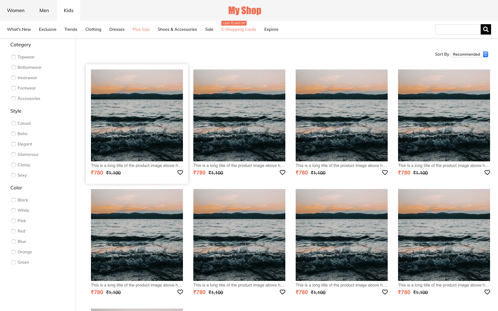

# List of Assignments

## Week 1

### Day 3: Git commit and push

Remember to change your default branch to `dev` before proceeding.

1. Create a folder named `day03` inside `week01`.
2. Create a file named `why_i_want_to_be_a_programmer.txt` inside the `day03` folder.
3. Write a short note in the file on why you want to be a programmer.
4. Commit the final changes and push to your repository.

> Solution session: _day-0_
>
> Due day: _day-0_

### Day 4: Creating an HTML page

1. Create a folder named `day04` inside `week01`.
2. Create a file named `programming-language-museum.html` inside the `day04` folder.
3. Write appropriate html code to achieve a page which looks like the image below.


> Solution session: _day-1_
>
> Due day: _day-1_

### Weekly Test: Create an html document which looks like the provided image


1. You have to use the exact tags as mentioned in the screenshot below.
2. Put your files under `assignments` > `week01` > `weekly-test`.


> Due day: _day-3_

----------
## Week 2

### Day 1: Create a webpage about yourself

1. Create a page about you with `html` and `css` having:
    1. A heading with your name.
    2. A short paragraph about you.
    3. A list of your favourite movies.
2. Put your files under `assignments` > `week02` > `day01`.

> Solution session: _day-0_
>
> Due day: _day-0_

### Day 2: Create a webmail page


1. Create a webmail page which has three sections:
    1. The left one is for navigation and contains links for Inbox, Sent, Drafts & Trash. You can use an un-ordered list to do that.
    2. The right box is a table of emails with coloumns for From, Subject & Date.
    3. The bottom one is for placing ads.
2. You can use sizes, colors, fonts, etc according to your choice.
3. Put your files under `assignments` > `week02` > `day02`.

> Solution session: _day-0_
>
> Due day: _day-0_

### Day 3: Create a company web page using Bootstrap 4

Home page

About Us page

Contact Us page


1. Do not use any custom css styles.
2. Use Bootstrap grid (rows and columns).
3. You are free to replace text content.
4. Put your files under `assignments` > `week02` > `day03`.

> Solution session: _day-0_
>
> Due day: _day-0_

### Day 5: Even numbers in descending order

1. Write a Javascript function that displays even numbers in descending order.
2. Start from `100` and end at `2`.
3. Sample output:
```
100
98
96
.
.
.
2
```
4. No HTML or CSS required.
5. Put your file under `assignments` > `week02` > `day05`.

> Solution session: _day-0_
>
> Due day: _day-0_

### Weekly Test: Create a shopping page


1. This is an assignment where you are required to build to given specifications.
2. Create a page which has these sections:
    1. The header at the top is fixed and does not hide on scroll.
    2. The next one is for navigation and contains links for categories and a search box. You can use an un-ordered list to do that. This is also fixed and does not hide on scroll.
    3. On the left we have a sidebar for filters. It has checkboxes
    4. On the right is the product catalogue including price and other details.
    5. You have a select dropdown for the 'Sort By' option.
3. Put your files under `assignments` > `week02` > `weekly-test`.

> Due day: _day-3_

----------
## Week 3

### Day 1: Print multiplication tables

1. `n` should be entered in a JS prompt on the browser.
2. The input should be a valid number (use `parseInt`).
3. The output should be shown on the console in the following format (assuming n is 5):
```
5 * 1 = 5
5 * 2 = 10
.
.
.
5 * 10 = 50
```
4. No HTML or CSS required.
5. Put your files under `assignments` > `week03` > `day01`.

> Solution session: _day-0_
>
> Due day: _day-0_

### Day 2: Looping and searching

1. Write a Javascript function that takes two inputs - an array and a search value.
2. Function should search for the search value in the array.
3. If the element is found, the function should return the position of the element in an array.
4. If the element is not found, the function should return `-1`.
5. No HTML or CSS required.
6. Put your files under `assignments` > `week03` > `day02`.

> Solution session: _day-0_
>
> Due day: _day-0_

### Day 3: Handling events

1. Create a `div` with `200px` height and width.
2. Add two event handlers for the div - `mouseover` and `mouseout`.
3. The `background-color` of the body should change to `pink` when the mouse hovers on it.
4. The `background-color` of the body should change to `white` when the mouse moves away from the `div`.
5. Put your files under `assignments` > `week03` > `day03`.

> Solution session: _day-0_
>
> Due day: _day-0_

### Weekly Test: Create a simple calculator


1. Use inputs of type `number`.
2. Use JS functions as event hadlers on the operation buttons.
3. Put your files under `assignments` > `week03` > `weekly-test`.

> Due day: _day-3_

----------
## Week 4

### Day 2: Quiz in jQuery 


1. The application should load a random question from the [quiz.json](data/quiz.json) file.
2. Once the user types an answer in the text input and clicks Submit, the app should check whether the answer is correct or not. Show a dialog window (prompt) depending upon the right/wrong answer.
3. Also, once the page is loaded, a timer should be started from 30 seconds and go down till 0 second. Once the timer reaches 0, the user should be shown a message saying that `Time is over!` and he/she should not be able to submit an answer after that.
4. For styling and layout, please use Bootstrap.

**Hint:** You can correctly use `Math.random()` to get a random number between 1 and 10.

> Solution session: _day-1_
>
> Due day: _day-1_

### Weekly Test: Library book search


Create a JavaScript application that lets the user search for books under a particular language.

1. Use AJAX to load [books.json](data/books.json)
2. Use an event handler to get the user input from the form.
3. Create DOM manipulation methods to show the search result in a table.
4. Every time a new search is made, make sure to clear out the last set of results.
5. You are free to use either vanilla JS or jQuery.
6. For the UI (input and tables), use Bootstrap.
6. Put your files under `assignments` > `week04` > `weekly-test`.

> Due day: _day-3_

----------
## Week 5

### Day 2: Express routing with req.params

1. An express application with four routes that perform addition, subtraction, multiplication and division.
2. The `add` route should take two url parameters and send back their sum.
3. The `sub` route should take two url parameters and send back their difference.
4. The `mul` route should take two url parameters and send back their product.
5. The `div` route should take two url parameters and send back their division result.

> Solution session: _day-1_
>
> Due day: _day-1_

### Day 4: Calculator in Express using post.

1. Create four routes in Express for add, sub, mul and div.
2. Each route should take two POST data parameters - `num1` and `num2` in JSON format and do the arithmetic operation on them.
3. Example output: For sum, the response should look like - 
```
{
    "num1": 20
    "num2": 50,
    "result": 70
}
```
4. No need for UI. Everything can be tested using Postman.

> Solution session: _day-0_
>
> Due day: _day-0_

### Weekly Test: Twitter app

1. Store a set of name and tweet data in a variable in Express.
    ```
    var tweets = [
        {
            name: "digitizer",
            tweet: "This is a cool piece of information."
        },
        {
            name: "M0SH",
            tweet: "@digitizer I agree."
        }
    ]
    ```
2. A default route which displays this data in the UI.
3. This page displays a form - a _name_ input, a _tweet_ input and a _submit_ button at the end.
4. A form action handler for the POST request on the submit button. You can post data directly as urlencoded or use JavaScript to post it as JSON.
4. Update `tweets[]` on a successful POST request.
5. Also, update the UI to reflect the new tweets that have been posted.
6. Put your files under `assignments` > `week05` > `weekly-test`.

> Due day: _day-3_

----------
## Week 6

### Day 2: About Me

1. Refer to the assignment on `week02-day01` and convert it to a backend assignment.
2. Store your details in an object, e.g.
```
var me = {
    firstname: "Ruhan",
    lastname: "Khandakar",
    bio: "Hi I am Ruhan. I belongs to Cooch Behar from beautiful West Bengal state. I was Mathematics student but now my everything is Programming. I am Self-motivated, creative Front-End web developer, specialising in Responsive Design with a keen interest in JavaScript.",
    movies: [
        "Avengers: Endgame",
        "Avengers: Infinity War",
        "Thor: Ragnarok",
        "Doctor Strange",
        "Iron Man"
    ]
}
```
3. Use handlebars to pass data to your UI.
4. Display name in `h1`, bio in `p` and movies in `ul`. No CSS required.
5. Put your files under `assignments` > `week06` > `day02`.

> Solution session: _day-0_
>
> Due day: _day-0_

### Day 3: Login portal in Express

1. A _students_ variable which stores data for students including their `username` and `password`.
2. A _login_ form as created in today's lecture.
3. An _authentication_ route which uses a students.json to verify login.
4. A _redirection_ route only visible after successful login. You can use the webmail assignment as this protected route.
5. A _logout_ route to destroy the session.
6. Put your files under `assignments` > `week06` > `day03`.

> Solution session: _day-0_
>
> Due day: _day-0_

### Weekly Test: Twitter app with login

1. Store a set of usernames and passwords in `data/users.json`.
    ```
    [
        {
            username: "digitizer",
            password: "digitizer"
        },
        {
            username: "mosh",
            password: "hello123"
        }
    ]
    ```
2. Store a set of names and tweets data in `data/tweets.json`.
    ```
    [
        {
            name: "digitizer",
            tweet: "This is a cool piece of information."
        },
        {
            name: "M0SH",
            tweet: "@digitizer I agree."
        }
    ]
    ```
2. Create a `/login` route which shows a form to log a user into the app.
3. Create a `/auth` route to match the form data posted in the above step against data in `data/users.json`.
4. Create a `/` route which displays the list of tweets only on a successful login, else redirect to login page. You must use handlebars here to display the tweets.
5. Put your files under `assignments` > `week06` > `weekly-test`.

**Note:** No need of posting new tweets by the logged in user. We had already done that in the last weekly test.

> Due day: _day-3_

----------
## Week 7

### Day 1: Login portal in Express + MongoDB

1. Make a copy of the assignment `week06-day03`.
2. There must be a collection of students in your MongoDB database which holds the `username` and `password` to be matched.
3. Change the assignment to do the authentication from this database rather than a variable in express.
4. Put your files under `assignments` > `week07` > `day01`.

> Solution session: _day-1_
>
> Due day: _day-1_

### Day 2: Add student to database

1. Make a copy and continue with the previous assignment.
2. Create a protected form which allows adding a new student with the following details.
```
firstname, lastname, gender, hometown, username, password
```
3. This form should post to an express route which adds the document to the MongoDB collection.
4. Put your files under `assignments` > `week07` > `day02`.

> Solution session: _day-1_
>
> Due day: _day-1_

### Day 3: Get student by hometown

1. Make a copy and continue with the previous assignment.
2. Create an API endpoint which returns data in JSON format.
`/getStudent?hometown=Delhi` should return an array for all student objects with hometown 'Delhi'. (available without login)
3. Render a hbs template on the default route `/` which has one button with text `Delhi`. (available only after login).
4. Use the API in step 2 on the default route `/`. Clicking on the button should display an array of students from Delhi in `div id='result'`.
5. No need to do this for other towns, only a button for `Delhi` is enough.
6. You will have to use jQuery / JS inside your hbs to make the API call.
7. Put your files under `assignments` > `week07` > `day03`.

> Solution session: _day-2_
>
> Due day: _day-2_

### Weekly Test: Modify and delete

1. Make a copy and continue with the previous assignment.
2. Create an API endpoint `/student?id='xxxxxxx'` for a `PUT` and a `DELETE` request. (available without login)
3. Passing the student ObjectID here will either update or delete the corresponding student document.
4. In case of a `PUT` request, the update parameters will be send as JSON inside `req.body`.
5. Use Postman to test both of these request routes.
6. Put your files under `assignments` > `week07` > `weekly-test`.

----------
## Week 8

### Day 2: AttainU Portal - Part 1

1. Create a MongoDB database named `attainu`.
2. This database should contain 2 collections:
    - `students` (name, email, phone, age, etc.).
    - `instructors` (name, email, phone, age, etc.).
3. Fill in dummy data inside these collections - at least 3 documents each.
4. Create a route `/students` to show each student information in the form of a bootstrap card.
5. There should be one card per student.
6. Repeat the same for instructors on the route `/instructors`.
7. Put your files under `assignments` > `week08` > `day02`.

> Solution session: _day-1_
>
> Due day: _day-1_

### Day 3: AttainU Portal - Part 2

1. Create a view at `/students/add` with a form to add a new student to the collection.
2. The view should be rendered through Handlebars.
3. This should make a POST request to an API endpoint `students/student`.
4. You should use an AJAX script in an external JS file for this.
5. The API endpoint should make relevant entries in the MongoDB collection.
6. Put your files under `assignments` > `week08` > `day03`.

> Solution session: _day-1_
>
> Due day: _day-1_

### Weekly Test: AttainU Portal - Part 3

1. In the previously created route `/students`, add a button `Delete` for each bootstrap card. 
2. Store Mongo ObjectID of the student in the button like this:
```
<button name="student-delete" type="submit" value="xxxxxxxxxx">Delete</button>
```
3. Clicking on `Delete` should make a `DELETE` request to `students/student/xxxxxxxxxx`.
4. The API endpoint should compare the `id` and delete relevant entries in the MongoDB collection.
5. Put your files under `assignments` > `week08` > `weekly-test`.

> Due day: _day-1_

## Week 13 

### Weekly Test 
1) Create a folder called weeklyTests/es6WrapUp inside your repository
2) setup Babel for this folder (Basic configuration is enough)
3) Write a class called User with below properties and export it (name it person.js)
    -> Variables
        -> `Name` 
        -> `Age` 
        -> `Email` 
    -> Methods
        -> `constructor`
            -> set the above properties using constructor 
        -> `sayHello` 
            -> This function should print the outpuy saying `Hey {name}, How are you doing?`
4) import the above class in a file called index.js and create 2 objects with the choice of your own values for the properties and `sayHello`  
5) Write a javascript closure to count the number of button clicks (UI is not needed, but you are free to do) 
6) Write a module inside module.js and write a sort function inside the module file and export the module. Given an input, it has to sort the array and return the sorted output. 
7) import the module inside index.js and sort a random array of your choice 
8) Given an array of objects of your choice, where each object should have the properties `name`, `age`
    -> Use the filter function to get the array of objects who's age is less than 30 
    -> Use a reduce function to find the average age of the people (Hint: sum_the_age/totalLength)
9) Repeat question 8 using the methods of lodash  

## Week 14

### Day 01 

`let shoppingCart = [`
  `{ productTitle: "Functional Programming", type: "books", amount: 10 },`
  `{ productTitle: "Kindle", type: "eletronics", amount: 30 },`
  `{ productTitle: "Shoes", type: "fashion", amount: 20 },`
  `{ productTitle: "Clean Code", type: "books", amount: 60 }`
`]`

Calculate the `total amount` of all books in our shopping cart using `filter`, `map`, `reduce`. Follow the below conditions 
1) filter by book type
2) transform the shopping cart into a collection of amount
3) combine all items by adding them up

## Week 15

### Day 02 

Implemente Binary Search 

### Day 03 

Implement Selection Sort & Bubbule Sort

### Day 04 
1) Given a number `n` write a recursive function to calculate the multiplication from 1-n
2) Implement Merge sort

### Day 05 

Implement Quick Sort 

### Weekly Test 

1) Count number of occurrences of a number in a sorted array with duplicates
    Given a sorted array of integers containing duplicates, count occurrences of a number provided. If the element is not found, return 0;
    Input Array: [2,5,5,5,6,6,7];
    Target Number: 5
    Output: 3 // 5 has come 3 times in the array
    `Use only Binary Search Algorithm`

2) Scoring in Exam
    Milly is at the examination hall where she is reading a question paper. She checked the question paper and discovered that there are N questions in that paper. Each question has some score value. Ideally it's like questions requiring more time have more score value and strangely no two questions on the paper require same time to be solved.

    She is very excited by looking these questions. She decided to solve K questions while maximizing their score value. Could you please help Milly to determine the exact time she needs to solve the questions.

    Input
        Time: [2,3,9,4,5]
        Score: [3,5,11,6,7]
        K = 3
    Output
        18 // 9+4+5 for the scores 11,6,7

    `Use Bubble Sort`

3) Given a set of strings print the set sorted according to their size. If the size of the strings are equal, must maintain the original order of the set.
    Input: ["ab", "cd", "e", "j", "asd", "ljffg", "df"];
    Output: ["e" "j" "ab" "cd" "df" "asd" "ljffg"];
    `Use Merge Sort`

4) Repeat Question 3 using `Quick Sort`. *Ignore the original order (Initial order can change)

## Week 16 
### Day 2
// Implement the below functions for single linked list
addFirst(){
  // add the new node in the beginning of the list 
}

addEnd(){
  // add the new node in the end of the list 
}

addMiddle(){
  // add the element in the middle of the list 
}

deleteFirst(){
  // delete the first node in the list 
}

deleteEnd(){
  // delete the last node in the list 
}

deleteMiddle(){
  // delete the node in the middle
}

### Day 3 
1) Implement Stack using linked list 
2) Implement Queue using linked list 

### Day 4 
Implement Hash Table 
    i) Set Item 
    ii) Get Item 
    iii) Delete Item 

### Day 5
Implement given an array which is a max Heap [27, 15, 24, 9, 13, 7, 3], write a new function to insert the element and write a function to delete the element. 

## Week 17 
### Day 1
Extend last question to delete any element from the heap. Given an element, find it's index and delete from the heap and heapify the tree.

### Day 2 
Implement priority queue by extending the heap implemented earlier, and have the below functions
1) Add item with priority 
2) Remove given item 
3) Change the priority for the item 

### Day 3 
Implement BST insertion 
Implement findElement function to search inside BST 

### Day 4 
Implement BST deletion 

### Day 5 
No assignment 

## Week 18
### Day 1
1) Implement BSF for trees
2) Implement DSF for trees

## Week 19
### Day 1
1) Implement BSF for graphs
2) Implement DSF for graphs

### Weekly Test 
Validate Sudoku
Determine if a 9x9 Sudoku board is valid. Only the filled cells need to be validated according to the following rules:
1) Each row must contain the digits 1-9 without repetition.
2) Each column must contain the digits 1-9 without repetition.
3) Each of the 9 3x3 sub-boxes of the grid must contain the digits 1-9 without repetition.
The Sudoku board could be partially filled, where empty cells are filled with the character '.'
Input:
[
 ["5","3",".",".","7",".",".",".","."],
 ["6",".",".","1","9","5",".",".","."],
 [".","9","8",".",".",".",".","6","."],
 ["8",".",".",".","6",".",".",".","3"],
 ["4",".",".","8",".","3",".",".","1"],
 ["7",".",".",".","2",".",".",".","6"],
 [".","6",".",".",".",".","2","8","."],
 [".",".",".","4","1","9",".",".","5"],
 [".",".",".",".","8",".",".","7","9"]
]
Output: true
Input:
[
 ["8","3",".",".","7",".",".",".","."],
 ["6",".",".","1","9","5",".",".","."],
 [".","9","8",".",".",".",".","6","."],
 ["8",".",".",".","6",".",".",".","3"],
 ["4",".",".","8",".","3",".",".","1"],
 ["7",".",".",".","2",".",".",".","6"],
 [".","6",".",".",".",".","2","8","."],
 [".",".",".","4","1","9",".",".","5"],
 [".",".",".",".","8",".",".","7","9"]
]
Output: false
Explanation: Same as Example 1, except with the 5 in the top left corner being modified to 8. Since there are two 8's in the top left 3x3 sub-box, it is invalid.

### Monthlly Test DS & Algo 
1)  Given a string, find the length of the longest substring which has no repeating characters.

    Input: String="aabccbb"
    Output: 3
    Explanation: The longest substring without any repeating characters is "abc".

    Input: String="abbbb"
    Output: 2
    Explanation: The longest substring without any repeating characters is "ab".

    Input: String="abccde"
    Output: 3
    Explanation: Longest substrings without any repeating characters are "abc" & "cde".


2)  Given an array containing 0s, 1s and 2s, sort the array in-place. You should treat numbers of the array as objects, hence, we can’t count 0s, 1s, and 2s to recreate the array.

    The flag of the Netherlands consists of three colors: red, white and blue; and since our input array also consists of three different numbers that is why it is called Dutch National Flag problem.

    Input: [1, 0, 2, 1, 0]
    Output: [0 0 1 1 2]

3)  Given a binary tree, populate an array to represent its zigzag level order traversal. You should populate the values of all nodes of the first level from left to right, then right to left for the next level and keep alternating in the same manner for the following levels.

4)  Given a binary tree and a number sequence, find if the sequence is present as a root-to-leaf path in the given tree.
    Ex. Sequence: [1, 9, 9]

5)  Given an array of non-negative integers, you are initially positioned at the first index of the array.

    Each element in the array represents your maximum jump length at that position.

    Your goal is to reach the last index in the minimum number of jumps.
    Input: [2,3,1,1,4]
    Output: 2
    Explanation: The minimum number of jumps to reach the last index is 2.
        Jump 1 step from index 0 to 1, then 3 steps to the last index.

## Week 20 

### Day 03
Create React Hello World App 

### Day 04 

Create a LoginForm component that renders two inputs and a button to render as a login form.

### Day 5
React Simple Calculator

### Weekly Test - Week 20 
Create a temperature converter
1) Create Component called Input which should return an input box
2) Create a component called Temperature and  create 2 input boxes using the Input component created in step-1. One input represents the temperature in centigrade and another represents the temperature  in Fahrenheit.
3) Your job is to communicate between these 2 inputs and convert from one format to the other format when there is a change in the input.
4) Maintain a state in Temperature component which will hold both the values while there is a change in the input
4) Integrate Bootstrap and use the classes of bootstrap for the inputs

## Week 21

### Day 01 
assignments/images/week20-day01-home
assignments/images/week20-day01-aboutus
assignments/images/week20-day01-contactus

### Day 05 
Simple Redux Store
Create a Redux store and reducer with the following initial state :

currentScore: 0
The reducer should accept the following actions -

UPDATE_BONUS
LEVEL_COMPLETED
LIFE_LOST

UPDATE_BONUS should increment the currentScore by 100 LEVEL_COMPLETED should increment the currentScore by 500 LIFE_LOST should decrement the currentScore by 250

## Week 24 

### Day 05 
Implement a blog application using the below APIs. All the communication should happen via Redux :slightly_smiling_face: Write down the requirements by yourself from the APIs.
https://jsonplaceholder.typicode.com/